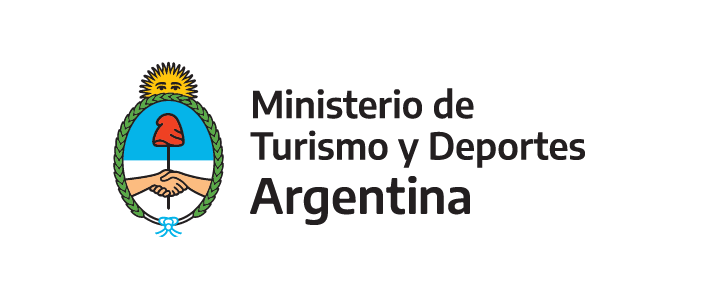

```{r setup, include=FALSE}
knitr::opts_chunk$set(echo = F, message = F, warning = F, 
                      fig.align = 'left')

library(extrafont) # Tools for using fonts, CRAN v0.17 # Tools for using fonts, CRAN v0.17

```


### [TURISMO INTERNACIONAL](https://tableros.yvera.tur.ar/turismo_internacional/)


## Reportes

#### * [Encuesta de Ocupación Hotelera (EOH)](https://tableros.yvera.tur.ar/reportes/eoh/EOH-mayo-2021.html)

#### * [Parques Nacionales](https://tableros.yvera.tur.ar/reportes/parques/ficha_parques_nacionales.html)

#### * [Encuesta de Viajes y Turismo de los Hogares (EVYTH)](https://tableros.yvera.tur.ar/reportes/evyth/ficha_trimestral_evyth.html)

#### * [Turismo Internacional](https://tableros.yvera.tur.ar/reportes/turismo_internacional/ficha_turismo_internacional.html)


---


<body>
  <h3>Para más información:</h3>
    <p style="text-align: left;">
  Estadísticas de turismo:   <br>
<a href="https://yvera.gob.ar/estadistica">yvera.gob.ar/estadistica</a>
  <br><br>
  Datos abiertos:   <br>
<a href="http://datos.yvera.gob.ar/">datos.yvera.gob.ar</a>
  <br>  
  </p>
  <br>
  <a href="https://www.argentina.gob.ar/turismoydeportes"></a> 
    </body>